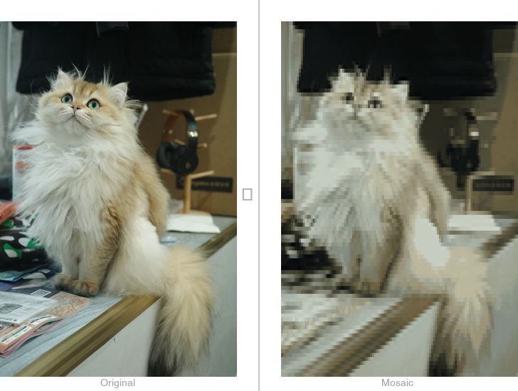

<p align="center">
  
</p>

<h1 align="center">BitVibe</h1>

<p align="center">
  Turn any image into a pixel-art mosaic —<br>
  rendered in the terminal with ANSI TrueColor, saveable as PNG.<br>
  No aspect distortion. Auto terminal-width detection.
</p>

<br>

<p align="center">
  
</p>

<br>

## Presets

```bash
pip install Pillow

# Sharp pixel-art (high-res, blocks, posterize)
python3 bitvibe.py --preset sharp -i photo.JPG

# Retro look (16-colour palette + dithering)
python3 bitvibe.py --preset retro -i photo.JPG
```

## Quick Flags

| Flag | What it does |
|---|---|
| `-w 80` | Mosaic width (default: auto = terminal width) |
| `--posterize 12` | Flat colour regions |
| `--palette` | Map to a fixed palette (default: `retro`) |
| `--palette gameboy` | Game Boy 4-shade green |
| `--palette pico8` | PICO-8 inspired 16-colour |
| `--list-palettes` | List all available palettes and exit |
| `--dither` | Floyd-Steinberg dithering (w/ `--posterize`) |
| `--gamma 2.2` | Perceptual brightness mapping |
| `--edge` | Contour emphasis |
| `--no-halfblock` | Fall back to symbol-per-cell mode |

See `python3 bitvibe.py --help` for all flags.

<br>

## License

MIT
