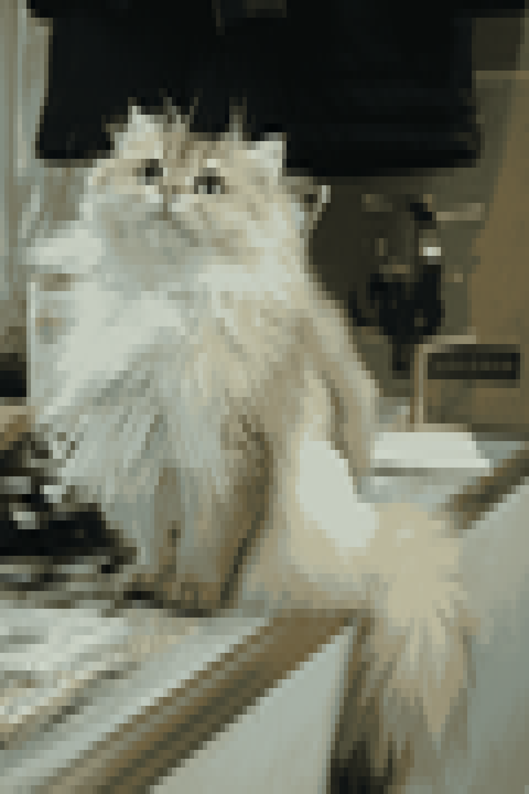
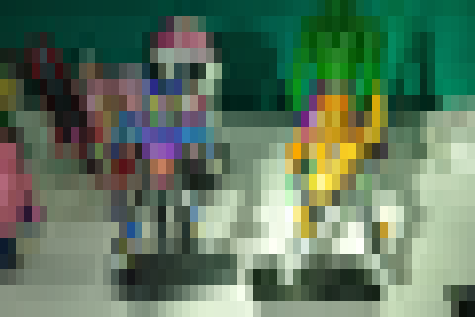

# BitVibe 

Turn any image into a **bit-style pixel-art mosaic** — rendered in the terminal with colored ANSI symbols, also saveable as PNG.


`--preset sharp` — w=120, blocks symbol set, posterize 12 colors

## Quick Start

```bash
pip install Pillow

# Basic terminal render
python3 bitvibe.py -i photo.JPG

# Sharp pixel-art look + save to PNG
python3 bitvibe.py --preset sharp -i photo.JPG -o mosaic.png
```

## Options

| Flag | Description |
|---|---|
| `-i`, `--input` | Input image path **(required)** |
| `-w`, `--width` | Mosaic width in tiles (default: `80`) |
| `-s`, `--symbols` | Symbol set: `default` · `blocks` · `dots` · `cross` · `simple` |
| `-o`, `--output` | Save as PNG |
| `--preset` | `sharp` = `-w 120 -s blocks --posterize 12` |
| `--posterize N` | Reduce to N flat colours (e.g. `--posterize 12`) |
| `--edge` | Emphasize contours via edge detection |

See `python3 bitvibe.py --help` for all flags.


Basic render, w=80, default symbols

## License

MIT
